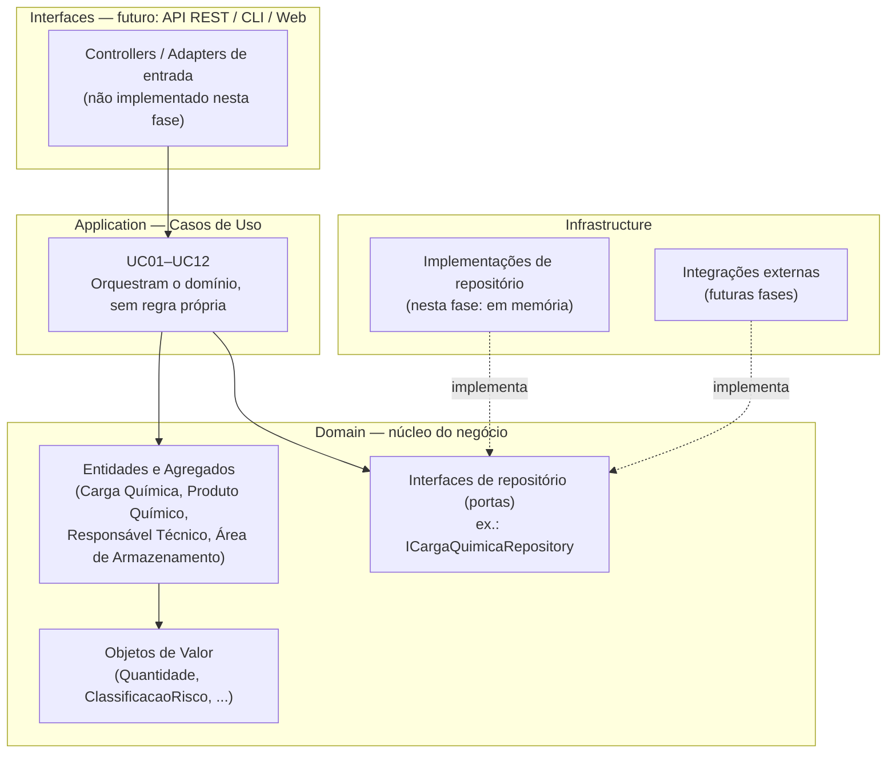

# Arquitetura — QuimiPort

Este documento cobre as seções 5 e 6 do PDF do Tech Challenge: a arquitetura proposta para o QuimiPort e a organização inicial de pastas/responsabilidades. As justificativas de cada decisão (por que camadas separadas, por que TypeScript, como evoluir) ficam em [`decisoes-arquiteturais.md`](decisoes-arquiteturais.md); aqui o foco é descrever **como** a arquitetura se estrutura.

## Estilo arquitetural

O QuimiPort adota uma **arquitetura em camadas inspirada em Clean Architecture / Ports & Adapters, com DDD tático concentrado no núcleo do domínio**. A escolha decorre diretamente do que já foi modelado em [`dominio.md`](dominio.md) e [`regras-de-negocio.md`](regras-de-negocio.md): as regras de negócio (RN01–RN13) vivem como invariantes dentro dos agregados (`Carga Química`, `Produto Químico`, `Responsável Técnico`, `Área de Armazenamento`), e a arquitetura só formaliza onde cada peça do sistema se encaixa em torno desse núcleo.

Quatro camadas, com dependência sempre apontando para dentro (em direção ao domínio):

| Camada | Responsabilidade | Depende de |
|---|---|---|
| **Interfaces** (apresentação) | Pontos de entrada do sistema (API REST, CLI, futura Web/mobile). Traduz requisições externas em chamadas aos casos de uso. | Application |
| **Application** (aplicação) | Implementa os casos de uso (UC01–UC12 de [`casos-de-uso.md`](casos-de-uso.md)): orquestra o domínio, não contém regra de negócio própria. | Domain |
| **Domain** (domínio) | Entidades, agregados, objetos de valor, regras de negócio (invariantes) e as interfaces (portas) de repositório. Não depende de nenhuma outra camada. | — |
| **Infrastructure** (infraestrutura) | Implementações concretas das portas definidas no domínio: persistência (nesta fase, em memória), futuras integrações externas. | Domain (implementa suas interfaces) |

## Diagrama de arquitetura em camadas



**Regra de dependência:** setas sólidas indicam "depende de"; setas pontilhadas indicam "implementa a interface de". `Domain` não tem nenhuma seta saindo dele em direção a outra camada — é o centro da arquitetura e pode ser testado isoladamente, sem banco de dados, sem framework web, sem infraestrutura nenhuma. `Infrastructure` depende do `Domain` (implementa suas interfaces), e não o contrário — isso é o que permite trocar a persistência em memória por um banco real, nas próximas fases, sem alterar uma linha de regra de negócio.

## Organização de pastas

Estrutura inicial proposta (sem implementação completa nesta fase — apenas a organização que orientará a construção do código):

```
quimiport/
├── README.md
├── docs/                                   # documentação desta fase (já entregue)
│   └── ...
├── src/
│   ├── domain/
│   │   ├── carga-quimica/                  # agregado raiz do domínio
│   │   │   ├── CargaQuimica.ts
│   │   │   ├── DocumentoCarga.ts           # entidade interna ao agregado
│   │   │   ├── Inspecao.ts                 # entidade interna ao agregado
│   │   │   ├── value-objects/
│   │   │   │   ├── Quantidade.ts
│   │   │   │   ├── ClassificacaoRisco.ts
│   │   │   │   ├── StatusCarga.ts
│   │   │   │   └── PeriodoValidade.ts
│   │   │   ├── ICargaQuimicaRepository.ts  # porta (interface)
│   │   │   └── errors/
│   │   │       └── CargaQuimicaError.ts
│   │   ├── produto-quimico/
│   │   │   ├── ProdutoQuimico.ts
│   │   │   ├── IProdutoQuimicoRepository.ts
│   │   │   └── errors/
│   │   ├── responsavel-tecnico/
│   │   │   ├── ResponsavelTecnico.ts
│   │   │   ├── value-objects/
│   │   │   │   └── RegistroProfissional.ts
│   │   │   └── IResponsavelTecnicoRepository.ts
│   │   └── area-armazenamento/
│   │       ├── AreaArmazenamento.ts
│   │       └── IAreaArmazenamentoRepository.ts
│   │
│   ├── application/
│   │   └── use-cases/
│   │       ├── cadastrar-produto-quimico/          # UC01
│   │       ├── inativar-produto-quimico/           # UC02
│   │       ├── registrar-carga-quimica/            # UC03
│   │       ├── validar-documentacao-carga/         # UC04
│   │       ├── solicitar-inspecao/                 # UC05
│   │       ├── liberar-carga-quimica/              # UC06
│   │       ├── bloquear-carga-quimica/             # UC07
│   │       ├── cancelar-carga-quimica/             # UC09
│   │       ├── assumir-responsabilidade-tecnica/   # UC12
│   │       ├── consultar-cargas-por-status/        # UC10
│   │       └── consultar-historico-carga/          # UC11
│   │
│   ├── infrastructure/
│   │   ├── persistence/
│   │   │   └── in-memory/
│   │   │       ├── InMemoryCargaQuimicaRepository.ts
│   │   │       ├── InMemoryProdutoQuimicoRepository.ts
│   │   │       ├── InMemoryResponsavelTecnicoRepository.ts
│   │   │       └── InMemoryAreaArmazenamentoRepository.ts
│   │   └── config/
│   │
│   ├── interfaces/                          # reservado para próximas fases
│   │   └── http/                            # vazio nesta fase (API REST futura)
│   │
│   └── shared/
│       ├── types/                           # tipos e contratos compartilhados
│       └── errors/                          # erros de domínio comuns
│
├── tests/
│   ├── unit/
│   │   ├── domain/
│   │   └── application/
│   └── integration/                         # reservado para próximas fases
│
├── package.json
└── tsconfig.json
```

### Por que essa organização

- **Uma pasta por agregado dentro de `domain/`**, e não uma pasta genérica `entities/` — reforça que cada agregado é uma unidade coesa (entidades internas, VOs e porta de repositório vivem juntos), evitando que regras de um agregado vazem para outro.
- **`UC08 — Atualizar status da carga` não tem pasta própria em `application/use-cases/`.** Ele é, na prática, uma transição de estado interna ao agregado `Carga Química` (ex.: um método `transicionarStatus()`), invocada pelos demais casos de uso (UC04, UC05, UC06, UC07, UC09, UC12) — não um caso de uso disparado diretamente por um ator externo. Mantê-lo dentro do domínio, e não como um serviço de aplicação exposto, é consistente com o princípio de concentração de regras definido em [`regras-de-negocio.md`](regras-de-negocio.md).
- **As interfaces de repositório ficam no `domain/`, não no `infrastructure/`** — é a aplicação do princípio de inversão de dependência: o domínio define o contrato (`ICargaQuimicaRepository`), e a infraestrutura o implementa. Isso é o que possibilita testar os casos de uso com um repositório em memória (fase atual) e trocar por um repositório real (próximas fases) sem alterar domínio nem aplicação.
- **`interfaces/` e a subpasta `tests/integration/` já existem na estrutura, mas vazias** — o objetivo é deixar claro onde o projeto vai crescer (API REST, banco de dados, testes de integração) sem exigir que essa parte já esteja implementada nesta fase, conforme o próprio PDF define como escopo.

## Evolução futura

Esta arquitetura foi desenhada para as próximas fases sem exigir retrabalho no domínio: novas interfaces (API REST, depois talvez uma aplicação mobile) entram como novos adaptadores na camada `Interfaces`; um banco de dados real entra como novo adaptador na camada `Infrastructure`, implementando as mesmas portas já definidas no domínio. O detalhamento dessas decisões — e de outras, como a eventual separação em microsserviços — está em [`decisoes-arquiteturais.md`](decisoes-arquiteturais.md).