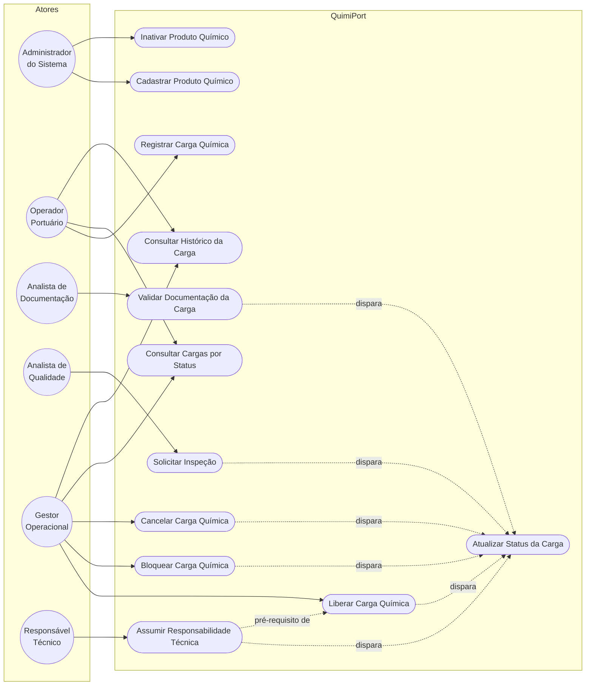
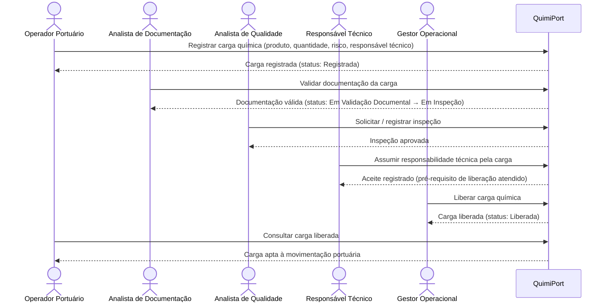

# Casos de Uso — QuimiPort

Este documento detalha os casos de uso planejados para o QuimiPort, conforme a lista de sugestões do PDF do Tech Challenge. Os atores utilizados são os perfis definidos em [`dominio.md`](dominio.md); as regras de negócio citadas são consolidadas em [`regras-de-negocio.md`](regras-de-negocio.md); os status da carga seguem o conjunto definido no glossário de [`dominio.md`](dominio.md) e detalhado em [`diagramas/fluxo-status.md`](diagramas/fluxo-status.md): `Registrada`, `Em Validação Documental`, `Em Inspeção`, `Liberada`, `Bloqueada`, `Cancelada`.

> **Nota sobre os atores:** o PDF define os perfis de usuário como exemplos, sem vincular cada um a um caso de uso específico. O mapeamento ator → caso de uso abaixo é uma definição do grupo, feita para manter coerência com as responsabilidades descritas em `dominio.md`.

## Visão geral (diagrama de casos de uso)

O caso de uso **Atualizar Status da Carga** não tem um ator humano direto: ele representa a transição de estado disparada como consequência de outros casos de uso (validação documental, inspeção, liberação, bloqueio, cancelamento), sempre respeitando as transições permitidas do fluxo de status.

## Fluxo principal (diagrama de sequência)

Fluxo feliz, do registro da carga até a liberação:

## Lista de casos de uso

| ID | Caso de uso | Ator principal |
|---|---|---|
| UC01 | Cadastrar produto químico | Administrador do Sistema |
| UC02 | Inativar produto químico | Administrador do Sistema |
| UC03 | Registrar carga química | Operador Portuário |
| UC04 | Validar documentação da carga | Analista de Documentação |
| UC05 | Solicitar inspeção | Analista de Qualidade |
| UC06 | Liberar carga química | Gestor Operacional |
| UC07 | Bloquear carga química | Gestor Operacional |
| UC08 | Atualizar status da carga | Sistema (consequência de outros UCs) |
| UC09 | Cancelar carga química | Gestor Operacional |
| UC10 | Consultar cargas por status | Operador Portuário / Gestor Operacional |
| UC11 | Consultar histórico da carga | Operador Portuário / Gestor Operacional |
| UC12 | Assumir responsabilidade técnica pela carga | Responsável Técnico |

---

### UC01 — Cadastrar produto químico

| Campo | Descrição |
|---|---|
| **Objetivo** | Cadastrar um novo produto químico no sistema, disponível para ser associado a cargas. |
| **Ator** | Administrador do Sistema |
| **Entrada esperada** | Nome do produto, classificação de risco (classe ONU/categoria de perigo), descrição opcional. |
| **Saída esperada** | Produto químico criado com status `Ativo`. |
| **Principais regras de negócio** | Um produto químico não pode ser cadastrado sem nome; um produto químico não pode ser cadastrado sem classe de risco. |
| **Possíveis erros/exceções** | Nome ausente ou vazio; classificação de risco ausente; produto duplicado (mesmo nome/identificação já cadastrado). |

### UC02 — Inativar produto químico

| Campo | Descrição |
|---|---|
| **Objetivo** | Inativar um produto químico, impedindo seu uso em novas cargas. |
| **Ator** | Administrador do Sistema |
| **Entrada esperada** | Identificador do produto químico a inativar. |
| **Saída esperada** | Produto químico com status alterado para `Inativo`. |
| **Principais regras de negócio** | Um produto químico inativo não pode ser usado em novas cargas. |
| **Possíveis erros/exceções** | Produto inexistente; produto já inativo. |

### UC03 — Registrar carga química

| Campo | Descrição |
|---|---|
| **Objetivo** | Registrar uma nova carga química associada a um produto, com quantidade, classificação de risco e responsável técnico. |
| **Ator** | Operador Portuário |
| **Entrada esperada** | Produto químico associado, quantidade, classificação de risco, responsável técnico. |
| **Saída esperada** | Carga química criada com status `Registrada`. |
| **Principais regras de negócio** | Uma carga química não pode ser registrada sem produto químico associado; não pode ser registrada com produto químico inativo; não pode ser registrada sem classificação de risco; a quantidade da carga deve ser maior que zero; toda carga deve possuir um responsável técnico informado. |
| **Possíveis erros/exceções** | Produto inexistente ou inativo; classificação de risco ausente; quantidade menor ou igual a zero; responsável técnico não informado. |

### UC04 — Validar documentação da carga

| Campo | Descrição |
|---|---|
| **Objetivo** | Anexar e validar os documentos obrigatórios de uma carga química. |
| **Ator** | Analista de Documentação |
| **Entrada esperada** | Identificador da carga, tipo de documento, número e período de validade. |
| **Saída esperada** | Documento(s) registrado(s) com status `Válido` ou `Inválido`; quando todos os documentos obrigatórios estiverem válidos, a carga avança de status (`Registrada` → `Em Validação Documental` → apta a seguir para inspeção). |
| **Principais regras de negócio** | Uma carga química não pode ser liberada sem documentação obrigatória válida. |
| **Possíveis erros/exceções** | Documento vencido; documento de tipo não reconhecido; carga inexistente; carga já cancelada ou bloqueada. |

### UC05 — Solicitar inspeção

| Campo | Descrição |
|---|---|
| **Objetivo** | Registrar a solicitação e o resultado de uma inspeção técnica sobre a carga. |
| **Ator** | Analista de Qualidade |
| **Entrada esperada** | Identificador da carga, data da inspeção, inspetor responsável, resultado e parecer. |
| **Saída esperada** | Inspeção registrada; carga com status `Em Inspeção` durante a avaliação; ao final, resultado `Aprovada` (segue para liberação) ou `Reprovada` (segue para bloqueio). |
| **Principais regras de negócio** | Uma carga em inspeção não pode ser finalizada sem antes ser liberada. |
| **Possíveis erros/exceções** | Carga sem documentação válida ainda (inspeção solicitada fora de ordem); carga já bloqueada ou cancelada; inspeção duplicada em aberto para a mesma carga. |

### UC06 — Liberar carga química

| Campo | Descrição |
|---|---|
| **Objetivo** | Autorizar a carga para movimentação portuária, após validação de todas as regras de segurança. |
| **Ator** | Gestor Operacional |
| **Entrada esperada** | Identificador da carga. |
| **Saída esperada** | Carga com status `Liberada`, apta à movimentação. |
| **Principais regras de negócio** | Uma carga química não pode ser liberada sem documentação obrigatória; uma carga cancelada não pode ser liberada; uma carga em inspeção não pode ser finalizada sem antes ser liberada; toda carga deve possuir um responsável técnico informado; a carga não pode ser liberada sem que o responsável técnico tenha assumido formalmente a responsabilidade (ver UC12). |
| **Possíveis erros/exceções** | Documentação pendente ou inválida; inspeção reprovada ou não concluída; responsável técnico ausente ou sem aceite formal registrado; carga já cancelada ou bloqueada. |

### UC07 — Bloquear carga química

| Campo | Descrição |
|---|---|
| **Objetivo** | Impedir a movimentação de uma carga que não atenda a alguma regra de negócio ou de segurança. |
| **Ator** | Gestor Operacional (bloqueio manual) ou sistema (bloqueio automático decorrente de inspeção reprovada ou documentação inválida) |
| **Entrada esperada** | Identificador da carga; motivo do bloqueio. |
| **Saída esperada** | Carga com status `Bloqueada`. |
| **Principais regras de negócio** | Uma carga bloqueada não pode entrar em movimentação. |
| **Possíveis erros/exceções** | Carga já liberada anteriormente (bloqueio após liberação exige tratamento específico, previsto para fases futuras); carga já cancelada. |

### UC08 — Atualizar status da carga

| Campo | Descrição |
|---|---|
| **Objetivo** | Refletir a transição de status da carga como consequência de outros casos de uso (validação documental, inspeção, liberação, bloqueio, cancelamento), garantindo que apenas transições permitidas ocorram. |
| **Ator** | Sistema (interno, disparado por outros casos de uso); Gestor Operacional em correções pontuais |
| **Entrada esperada** | Identificador da carga; status de origem e status de destino. |
| **Saída esperada** | Status atualizado e histórico de transição registrado. |
| **Principais regras de negócio** | Toda transição deve seguir o fluxo definido em [`diagramas/fluxo-status.md`](diagramas/fluxo-status.md); uma carga bloqueada não pode entrar em movimentação; uma carga cancelada não pode ser liberada. |
| **Possíveis erros/exceções** | Transição não permitida pelo fluxo de status (ex.: de `Cancelada` para `Liberada`). |

### UC09 — Cancelar carga química

| Campo | Descrição |
|---|---|
| **Objetivo** | Cancelar definitivamente uma carga química, encerrando seu fluxo operacional. |
| **Ator** | Gestor Operacional |
| **Entrada esperada** | Identificador da carga; motivo do cancelamento. |
| **Saída esperada** | Carga com status `Cancelada`. |
| **Principais regras de negócio** | Uma carga cancelada não pode ser liberada. |
| **Possíveis erros/exceções** | Carga já cancelada; carga já liberada e em movimentação (cancelamento pós-liberação exige tratamento específico, previsto para fases futuras). |

### UC10 — Consultar cargas por status

| Campo | Descrição |
|---|---|
| **Objetivo** | Listar cargas químicas filtradas por status atual. |
| **Ator** | Operador Portuário, Gestor Operacional |
| **Entrada esperada** | Status desejado (ex.: `Liberada`, `Bloqueada`). |
| **Saída esperada** | Lista de cargas que estão no status informado. |
| **Principais regras de negócio** | Não se aplica validação de negócio; caso de uso somente de leitura. |
| **Possíveis erros/exceções** | Status inválido/não reconhecido informado no filtro. |

### UC11 — Consultar histórico da carga

| Campo | Descrição |
|---|---|
| **Objetivo** | Exibir o histórico completo de transições de status, documentos e inspeções de uma carga. |
| **Ator** | Operador Portuário, Gestor Operacional, Analista de Qualidade |
| **Entrada esperada** | Identificador da carga. |
| **Saída esperada** | Linha do tempo com as transições de status, documentos anexados e inspeções realizadas. |
| **Principais regras de negócio** | Não se aplica validação de negócio; caso de uso somente de leitura. |
| **Possíveis erros/exceções** | Carga inexistente. |

### UC12 — Assumir responsabilidade técnica pela carga

| Campo | Descrição |
|---|---|
| **Objetivo** | Registrar a confirmação formal do Responsável Técnico assumindo a responsabilidade técnica pela carga, tornando-se pré-requisito para a liberação. |
| **Ator** | Responsável Técnico |
| **Entrada esperada** | Identificador da carga; identificador do responsável técnico já vinculado a ela. |
| **Saída esperada** | Carga com o aceite do responsável técnico registrado (`aceiteResponsavelTecnico` preenchido com data/hora). |
| **Principais regras de negócio** | Toda carga deve possuir um responsável técnico informado; a carga não pode ser liberada sem que o responsável técnico tenha confirmado formalmente a responsabilidade. |
| **Possíveis erros/exceções** | Responsável técnico não vinculado à carga; carga já cancelada ou bloqueada; aceite já registrado anteriormente (duplicidade). |