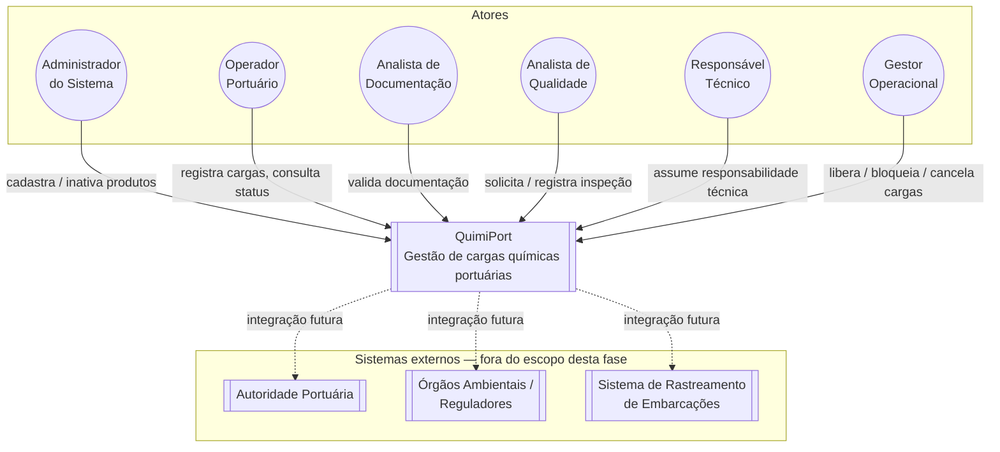

# Diagrama de Contexto da Aplicação

Diagrama sugerido pelo PDF do Tech Challenge (seção 7), complementar aos dois obrigatórios ([`dominio.md`](dominio.md) e [`fluxo-status.md`](fluxo-status.md)). Mostra o QuimiPort como uma caixa única, os atores que interagem com ele — os perfis definidos em [`../dominio.md`](../dominio.md) — e os sistemas externos que ficam fora do escopo desta fase.

## Diagrama

## Legenda

| Notação | Significado |
|---|---|
| Seta sólida | Interação já modelada nesta fase (ator → caso de uso, ver [`../casos-de-uso.md`](../casos-de-uso.md)). |
| Seta pontilhada | Integração prevista para fases futuras, fora do escopo atual. |

## Leitura do diagrama

Nesta fase, o QuimiPort só troca informação com pessoas — os seis perfis de usuário já mapeados em [`../dominio.md`](../dominio.md). Não existe, ainda, integração com sistemas externos (autoridade portuária, órgãos ambientais, rastreamento de embarcações): essas trocas aparecem na seção "Quais partes do sistema poderão evoluir nas próximas fases" de `../dominio.md` e são retomadas em [`../decisoes-arquiteturais.md`](../decisoes-arquiteturais.md) (ADR-04, evolução para backend) como pontos de extensão futuros, não como parte do escopo atual.

Este diagrama é a visão "de fora para dentro" do sistema; o diagrama de arquitetura em camadas, em [`../arquitetura.md`](../arquitetura.md), é a visão complementar "de dentro" — como o QuimiPort se organiza internamente para atender a essas interações.