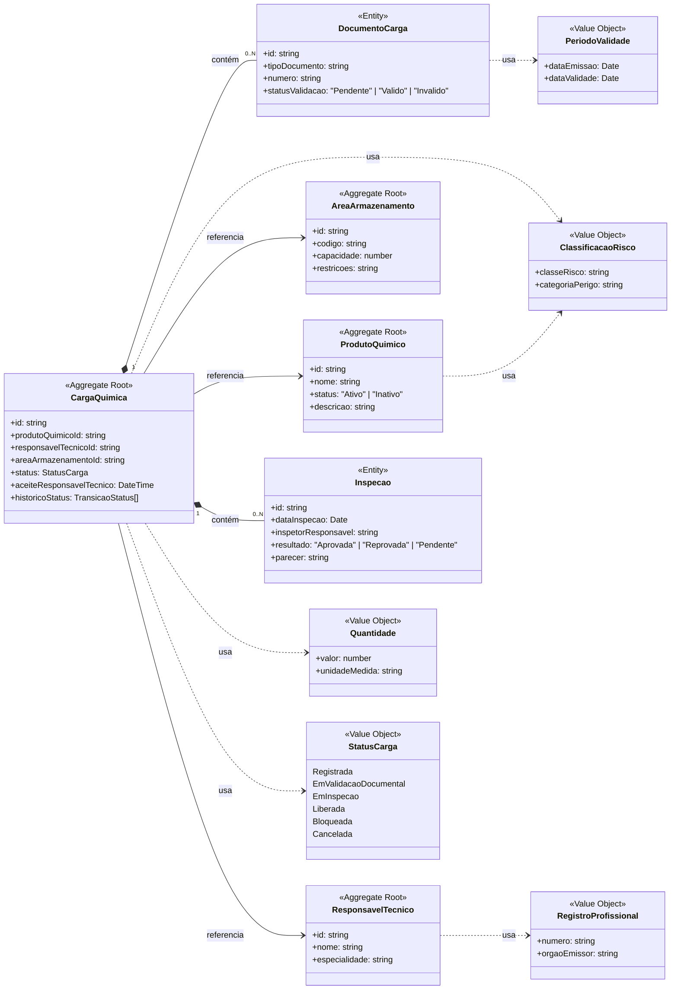

# Diagrama de Domínio — Agregados e Entidades

Diagrama obrigatório do Tech Challenge, representando as entidades, objetos de valor e agregados definidos em [`../dominio.md`](../dominio.md), com as regras consolidadas em [`../regras-de-negocio.md`](../regras-de-negocio.md).

## Legenda

| Notação | Significado |
|---|---|
| `<<Aggregate Root>>` | Raiz de agregado: tem identidade própria, é a única acessada diretamente por repositório, garante os invariantes do seu agregado. |
| `<<Entity>>` | Entidade interna a um agregado: tem identidade, mas só é acessada através da raiz. |
| `<<Value Object>>` | Objeto de valor: sem identidade própria, imutável, comparado por igualdade de atributos. |
| `*--` (composição) | Faz parte do agregado (ciclo de vida controlado pela raiz). |
| `-->` (associação) | Referência por identidade a um agregado diferente (ex.: `produtoQuimicoId`). |
| `..>` (dependência) | Uso de um objeto de valor. |

## Diagrama

## Leitura do diagrama

**Carga Química** é a raiz do agregado principal (a justificativa completa está em [`../dominio.md`](../dominio.md), seção 5). Ela concentra, dentro do seu limite transacional, as entidades **Documento da Carga** e **Inspeção** — ambas sem sentido fora do contexto de uma carga específica, por isso representadas aqui por composição (`*--`).

**Produto Químico**, **Responsável Técnico** e **Área de Armazenamento** são agregados independentes, cada um com seu próprio ciclo de vida e suas próprias regras (ex.: inativação de produto). A Carga Química não os contém — apenas os referencia por identificador (`produtoQuimicoId`, `responsavelTecnicoId`, `areaArmazenamentoId`), representado por associação (`-->`). Isso é o que impede, por exemplo, que a inativação de um Produto Químico afete diretamente cargas já registradas, e é a base da regra RN02/RN10 em [`../regras-de-negocio.md`](../regras-de-negocio.md) (a carga apenas consulta o status do produto, não o carrega consigo).

Os objetos de valor (`ClassificacaoRisco`, `Quantidade`, `RegistroProfissional`, `PeriodoValidade`, `StatusCarga`) não têm identidade: duas instâncias com os mesmos atributos são consideradas iguais, e são sempre substituídas por inteiro (nunca alteradas em memória), conforme será detalhado em [`../typescript-javascript.md`](../typescript-javascript.md).