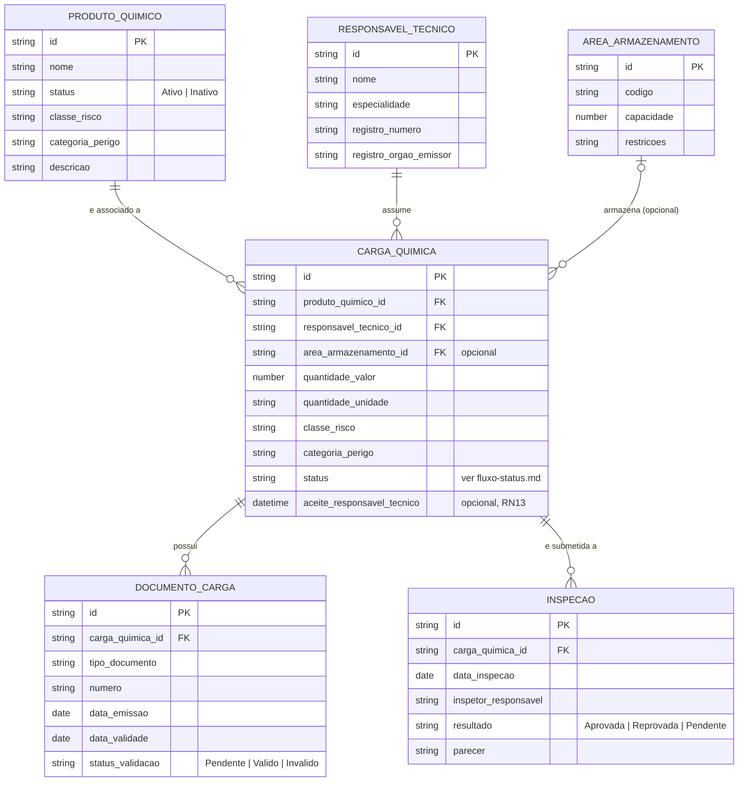

# Diagrama de Entidades e Relacionamentos Conceituais

Diagrama sugerido pelo PDF do Tech Challenge (seção 7). Enquanto o [diagrama de domínio](dominio.md) usa notação DDD (agregados, entidades, objetos de valor, raiz de agregado), este é um **ER conceitual**: mais próximo de como o modelo se traduziria em tabelas relacionais numa fase futura com banco de dados, útil para quem vai desenhar o esquema físico.

Os objetos de valor de [`../dominio.md`](../dominio.md) (`Quantidade`, `ClassificacaoRisco`, `RegistroProfissional`, `PeriodoValidade`) não têm identidade própria — por isso, aqui, aparecem como colunas embutidas na entidade que os usa, e não como tabelas separadas.

## Diagrama

## Leitura do diagrama

- **`CARGA_QUIMICA` → `PRODUTO_QUIMICO`** (obrigatório, N:1): toda carga referencia exatamente um produto (RN01); um produto pode não ter nenhuma carga ainda, ou ter várias.
- **`CARGA_QUIMICA` → `RESPONSAVEL_TECNICO`** (obrigatório, N:1): toda carga tem exatamente um responsável técnico informado (RN12).
- **`CARGA_QUIMICA` → `AREA_ARMAZENAMENTO`** (opcional, N:0..1): uma carga pode ainda não ter área de armazenamento definida — por isso o lado de `AREA_ARMAZENAMENTO` é "zero ou um", diferente das duas relações anteriores.
- **`CARGA_QUIMICA` → `DOCUMENTO_CARGA`** e **`CARGA_QUIMICA` → `INSPECAO`** (1:N, existência dependente): documentos e inspeções não existem sem uma carga — no [diagrama de domínio](dominio.md) essas duas são entidades internas ao agregado `Carga Química` (composição); aqui aparecem como tabelas próprias porque, em um modelo relacional, cada uma precisa da sua própria chave primária e chave estrangeira para `carga_quimica_id`.

## Diferença para o diagrama de domínio

Este ER e o [diagrama de domínio](dominio.md) descrevem o mesmo conjunto de conceitos com propósitos diferentes: o diagrama de domínio comunica **regras e comportamento** (o que cada agregado protege, quem é raiz, quem é interno); este ER comunica **estrutura de dados e cardinalidade**, como apoio a um futuro desenho de schema. Nenhum dos dois substitui o outro — o PDF pede os dois porque servem públicos e decisões diferentes.