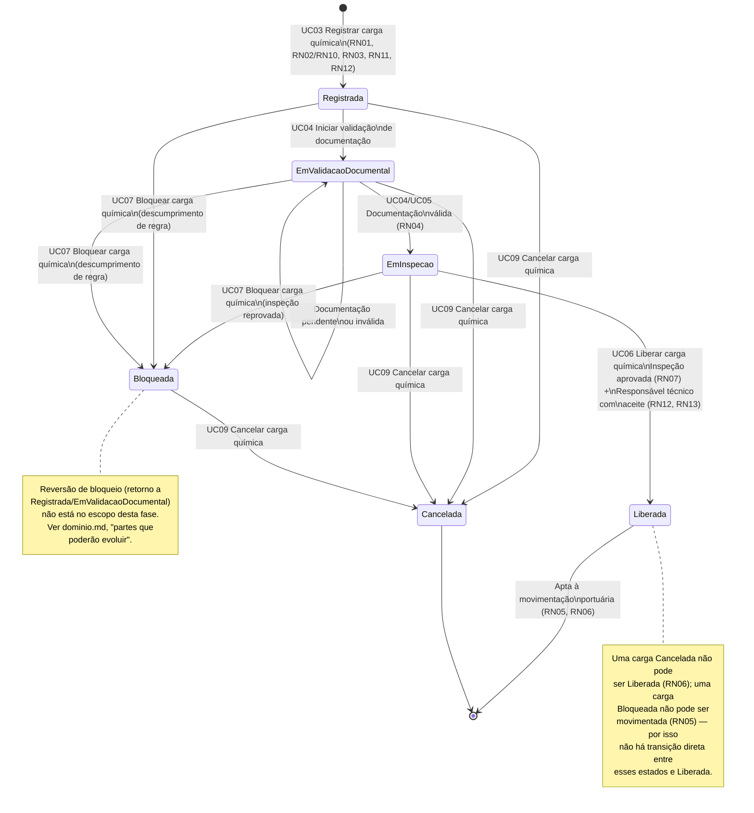

# Fluxo de Transição de Status da Carga Química

Diagrama obrigatório do Tech Challenge, representando o ciclo de vida do status da Carga Química (objeto de valor `StatusCarga`, definido em [`../dominio.md`](../dominio.md) e no [diagrama de domínio](dominio.md)). As transições seguem os casos de uso de [`../casos-de-uso.md`](../casos-de-uso.md) e são condicionadas pelas regras de negócio de [`../regras-de-negocio.md`](../regras-de-negocio.md).

## Estados

| Estado | Significado |
|---|---|
| `Registrada` | Carga criada (UC03), com produto ativo, classificação de risco, quantidade e responsável técnico informados. |
| `EmValidacaoDocumental` | Documentação obrigatória em conferência (UC04). |
| `EmInspecao` | Documentação validada; carga aguardando ou em processo de inspeção técnica (UC05). |
| `Liberada` | Carga aprovada em todas as validações, apta à movimentação portuária (UC06). |
| `Bloqueada` | Carga impedida de movimentação por descumprimento de regra de negócio/segurança (UC07). |
| `Cancelada` | Carga encerrada definitivamente, sem possibilidade de liberação (UC09). |

## Diagrama

## Leitura do diagrama

O fluxo feliz é `Registrada → EmValidacaoDocumental → EmInspecao → Liberada`, condicionado pelas regras de gate já detalhadas em [`../regras-de-negocio.md`](../regras-de-negocio.md) (fluxograma de UC06). A partir de `Registrada` ou `EmValidacaoDocumental`, uma carga pode ser bloqueada (UC07) ou cancelada (UC09) a qualquer momento em que descumprir uma regra de negócio. A partir de `EmInspecao`, o resultado da inspeção decide entre `Liberada` (aprovada) e `Bloqueada` (reprovada) — nunca há um estado "finalizado" fora dessas duas opções, o que corresponde à regra RN07 ("uma carga em inspeção não pode ser finalizada sem antes ser liberada").

`Liberada` e `Cancelada` são estados terminais nesta fase: o cancelamento de uma carga já liberada e a reversão de um bloqueio não são tratados aqui — ambos ficam registrados como evolução futura em [`../dominio.md`](../dominio.md) ("Quais partes do sistema poderão evoluir nas próximas fases").