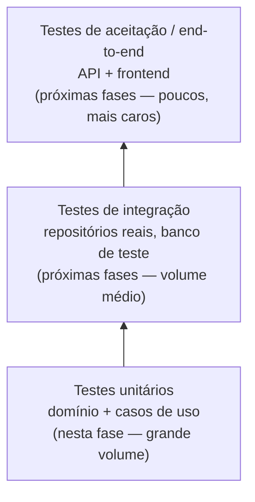

# Plano de Qualidade de Software — QuimiPort

Este documento cobre a seção 8 do PDF do Tech Challenge: o plano de qualidade do QuimiPort e como o projeto poderá ser testado nas próximas fases. Ele parte diretamente das regras de negócio ([`regras-de-negocio.md`](regras-de-negocio.md)) e dos casos de uso ([`casos-de-uso.md`](casos-de-uso.md)) já documentados.

## Regras de negócio que precisam ser testadas

Todas as regras RN01–RN13 de [`regras-de-negocio.md`](regras-de-negocio.md) são invariantes de agregado e, por isso, candidatas a teste unitário — nenhuma delas deve depender de infraestrutura para ser validada. A tabela de cenários de teste, mais abaixo, mapeia cada uma delas a pelo menos um cenário.

## Casos de uso mais críticos

Criticidade aqui significa: o quanto uma falha nesse caso de uso compromete segurança ou conformidade regulatória, não apenas experiência de uso.

| Caso de uso | Por que é crítico | Prioridade de teste |
|---|---|---|
| UC06 — Liberar carga química | É o ponto que autoriza movimentação real de produto perigoso; concentra a maioria das regras de segurança (RN04–RN07, RN12–RN13). | Alta |
| UC03 — Registrar carga química | Primeira barreira contra dados inválidos entrando no sistema (RN01–RN03, RN11, RN12). | Alta |
| UC07 — Bloquear carga química | Falha aqui pode deixar uma carga insegura circulando como se estivesse liberada. | Alta |
| UC12 — Assumir responsabilidade técnica | Pré-requisito formal de liberação (RN13); falha compromete rastreabilidade de responsabilidade. | Alta |
| UC05 — Solicitar inspeção | Resultado decide entre liberação e bloqueio (RN07). | Média |
| UC04 — Validar documentação da carga | Condiciona a liberação (RN04), mas erro aqui tende a travar o fluxo antes de causar dano (falha segura). | Média |
| UC09 — Cancelar carga química | Estado terminal; erro aqui é mais operacional que de segurança. | Média |
| UC01 / UC02 — Cadastrar / inativar produto químico | Cadastro de referência; impacto indireto (via RN02/RN10) nas cargas futuras. | Média |
| UC10 / UC11 — Consultas | Somente leitura, sem regra de negócio própria. | Baixa |

## Tipos de teste

## Testes unitários

Aplicados desde já ao domínio e à aplicação, sem qualquer infraestrutura real:

- **Domínio**: cada regra de negócio (RN01–RN13) testada diretamente na entidade/agregado/objeto de valor que a impõe — ex.: `Quantidade.criar(-5, "kg")` deve rejeitar (RN11); `CargaQuimica.liberar()` sem documentação válida deve rejeitar (RN04).
- **Aplicação**: cada caso de uso testado com um repositório em memória, verificando que ele orquestra corretamente o domínio (busca, chama o método certo, salva o resultado) — não reimplementa nem reinterpreta a regra, que já foi validada isoladamente no teste de domínio.
- Padrão de escrita: *Given / When / Then* (ou Arrange-Act-Assert), um cenário por teste, nomeado pela regra ou comportamento esperado — não pela implementação.
- Meta de cobertura: 100% dos caminhos de validação de RN01–RN13; cobertura geral do restante do código a ser definida pelo grupo na implementação, sem virar objetivo em si (cobertura alta não substitui teste que valida a regra certa).

## Testes de integração (próximas fases)

Só fazem sentido quando existir infraestrutura real para integrar:

- Repositórios reais (ex.: contra um banco de dados de teste, descartável por execução) validados contra o mesmo contrato de interface já usado pelos repositórios em memória — garantindo que a implementação real respeita o que o domínio espera.
- Quando a API REST existir (ver [`decisoes-arquiteturais.md`](decisoes-arquiteturais.md), ADR-04), testes de integração de contrato HTTP (status code, formato de payload) — sem duplicar a lógica de negócio, que já está coberta nos testes unitários.

## Validação dos fluxos principais

- O fluxo feliz completo — Registrar → Validar documentação → Solicitar inspeção → Assumir responsabilidade técnica → Liberar — é validado por um teste que exercita vários casos de uso em sequência sobre os mesmos repositórios em memória, espelhando o diagrama de sequência de [`casos-de-uso.md`](casos-de-uso.md).
- Cada transição do [diagrama de fluxo de status](diagramas/fluxo-status.md) deve ter pelo menos um teste correspondente — não só o caminho feliz, mas também bloqueio e cancelamento a partir de cada estado em que são permitidos, e a rejeição explícita de transições não permitidas (ex.: `Cancelada → Liberada`).

## Mocks e dados simulados

- Os repositórios em memória (`InMemoryCargaQuimicaRepository`, etc., já previstos em [`arquitetura.md`](arquitetura.md)) funcionam como *fakes* nos testes de caso de uso — implementações reais e simples da interface, não mocks de biblioteca. Isso valida o resultado real da operação em vez de apenas verificar "foi chamado com X", reduzindo testes frágeis.
- Dados de teste são criados por *builders* (padrão Object Mother), um por agregado (ex.: `CargaQuimicaBuilder`, `ProdutoQuimicoBuilder`), que produzem uma entidade válida por padrão e permitem customizar só o campo relevante ao cenário (ex.: `.comProdutoInativo()`, `.semDocumentacao()`) — mantendo cada teste legível e focado na regra que está validando.
- Nenhum teste desta fase depende de banco de dados real ou rede — determinístico e rápido, o que também viabiliza rodá-los a cada commit.

## Cenários de teste planejados

Inclui os exemplos do PDF e os cenários adicionais decorrentes das regras/casos de uso definidos pelo grupo (RN13, UC12, transições de status).

| # | Cenário | Regra(s) | Caso(s) de uso |
|---|---|---|---|
| 1 | Não permitir cadastro de produto químico sem nome | RN08 | UC01 |
| 2 | Não permitir cadastro de produto químico sem classe de risco | RN09 | UC01 |
| 3 | Não permitir registro de carga sem produto químico associado | RN01 | UC03 |
| 4 | Não permitir registro de carga com produto químico inativo | RN02 / RN10 | UC03 |
| 5 | Não permitir registro de carga sem classificação de risco | RN03 | UC03 |
| 6 | Validar quantidade maior que zero | RN11 | UC03 |
| 7 | Não permitir registro de carga sem responsável técnico informado | RN12 | UC03 |
| 8 | Não permitir liberação de carga sem documentação obrigatória | RN04 | UC04, UC06 |
| 9 | Permitir liberação de carga com documentação válida (caminho positivo) | RN04 | UC04, UC06 |
| 10 | Não permitir liberação de carga sem inspeção aprovada | RN07 | UC05, UC06 |
| 11 | Não permitir liberação de carga sem aceite formal do responsável técnico | RN13 | UC12, UC06 |
| 12 | Não permitir movimentação de carga bloqueada | RN05 | UC07 |
| 13 | Não permitir liberação de carga cancelada | RN06 | UC06, UC09 |
| 14 | Validar cada transição de status permitida e rejeitar transições não permitidas (ex.: `Cancelada → Liberada`) | RN05, RN06 | UC08 (interno) |

## Rastreabilidade

- Regra → cenário de teste: tabela acima;
- Regra → entidade/agregado: [`regras-de-negocio.md`](regras-de-negocio.md);
- Caso de uso → regras envolvidas: [`casos-de-uso.md`](casos-de-uso.md);
- Estrutura de pastas de teste (`tests/unit/`, `tests/integration/`): [`arquitetura.md`](arquitetura.md).