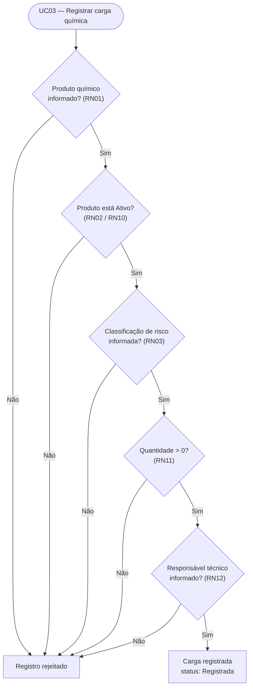
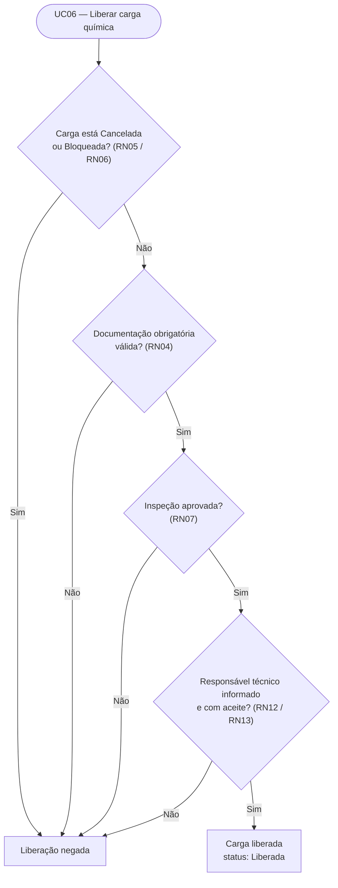

# Regras de Negócio — QuimiPort

Este documento consolida as regras de negócio do QuimiPort, seguindo o que pede o PDF do Tech Challenge: descrevê-las de forma clara e indicar onde cada uma deve ficar concentrada na arquitetura futura da aplicação. As regras abaixo vêm da lista de exemplos do PDF e das entidades/agregados já definidos em [`dominio.md`](dominio.md); a coluna de casos de uso referencia [`casos-de-uso.md`](casos-de-uso.md).

## Princípio de concentração das regras

Seguindo DDD, tratamos as regras de negócio como **invariantes do domínio**, concentradas nos próprios agregados/entidades (`Carga Química` e `Produto Químico`), e não nos casos de uso. Os casos de uso (camada de aplicação) apenas orquestram chamadas ao domínio — buscam dados via repositório, invocam os métodos do agregado — mas não reimplementam a validação. Essa separação está detalhada em [`arquitetura.md`](arquitetura.md); o foco aqui é registrar **qual regra existe** e **em qual entidade/agregado ela deve viver**.

## Tabela consolidada

| ID | Regra | Onde é validada | Caso(s) de uso relacionado(s) | Camada/local de concentração |
|---|---|---|---|---|
| RN01 | Uma carga química não pode ser registrada sem produto químico associado. | Agregado `Carga Química` | UC03 | Domínio — `Carga Química` (invariante de criação) |
| RN02 | Uma carga química não pode ser registrada com produto químico inativo. | Agregado `Carga Química`, consultando o status do `Produto Químico` referenciado | UC03 | Domínio — `Carga Química` |
| RN03 | Uma carga química não pode ser registrada sem classificação de risco. | Agregado `Carga Química` | UC03 | Domínio — `Carga Química` |
| RN04 | Uma carga química não pode ser liberada sem documentação obrigatória válida. | Agregado `Carga Química`, sobre a coleção `Documento da Carga` | UC04, UC06 | Domínio — `Carga Química` |
| RN05 | Uma carga bloqueada não pode entrar em movimentação. | Agregado `Carga Química` | UC07, UC08 | Domínio — `Carga Química` (invariante de transição de status) |
| RN06 | Uma carga cancelada não pode ser liberada. | Agregado `Carga Química` | UC06, UC09 | Domínio — `Carga Química` |
| RN07 | Uma carga em inspeção não pode ser finalizada sem antes ser liberada. | Agregado `Carga Química`, sobre a coleção `Inspeção` | UC05, UC06, UC08 | Domínio — `Carga Química` |
| RN08 | Um produto químico não pode ser cadastrado sem nome. | Entidade `Produto Químico` | UC01 | Domínio — `Produto Químico` |
| RN09 | Um produto químico não pode ser cadastrado sem classe de risco. | Entidade `Produto Químico` | UC01 | Domínio — `Produto Químico` |
| RN10 | Um produto químico inativo não pode ser usado em novas cargas. | Entidade `Produto Químico` (impõe seu próprio invariante de status), consultada por `Carga Química` | UC02, UC03 | Domínio — `Produto Químico` |
| RN11 | A quantidade da carga deve ser maior que zero. | Objeto de valor `Quantidade`, usado por `Carga Química` | UC03 | Domínio — VO `Quantidade` |
| RN12 | Toda carga deve possuir um responsável técnico informado. | Agregado `Carga Química` | UC03, UC06 | Domínio — `Carga Química` |
| RN13 | Uma carga química não pode ser liberada sem que o responsável técnico tenha confirmado formalmente a responsabilidade pela carga (aceite registrado). | Agregado `Carga Química`, campo `aceiteResponsavelTecnico` | UC06, UC12 | Domínio — `Carga Química` |

> **RN13** não está na lista de exemplos do PDF — foi identificada pelo grupo ao formalizar o caso de uso UC12 (Assumir responsabilidade técnica), decorrente da descrição de `dominio.md` de que o Responsável Técnico "assume tecnicamente" a carga. Está sinalizada aqui para manter rastreabilidade da origem da regra.

> **RN02 e RN10** descrevem a mesma restrição de negócio sob duas perspectivas: RN10 é o invariante do próprio `Produto Químico` (não pode ser usado quando inativo); RN02 é a consequência desse invariante checada no momento em que `Carga Química` é registrada. Mantidas como regras separadas por seguirem a redação original do PDF, mas a implementação deve evitar duplicidade de lógica — a checagem de "produto ativo" deve residir em um único lugar (`Produto Químico`) e ser apenas consultada por `Carga Química`.

## Regras aplicadas ao registro de carga (UC03)

## Regras aplicadas à liberação de carga (UC06)

Esses dois fluxos mostram apenas as **regras de negócio como gates de decisão** para os dois casos de uso mais críticos. O ciclo de vida completo dos status (todas as transições possíveis, incluindo bloqueio e cancelamento) está no diagrama obrigatório [`diagramas/fluxo-status.md`](diagramas/fluxo-status.md).

## Rastreabilidade

- Regras → entidades/agregados: ver [`dominio.md`](dominio.md), seções 3 (Entidades) e 5 (Agregados);
- Regras → casos de uso: ver coluna "Principais regras de negócio" de cada caso de uso em [`casos-de-uso.md`](casos-de-uso.md);
- Regras → testes planejados: ver [`qualidade.md`](qualidade.md).